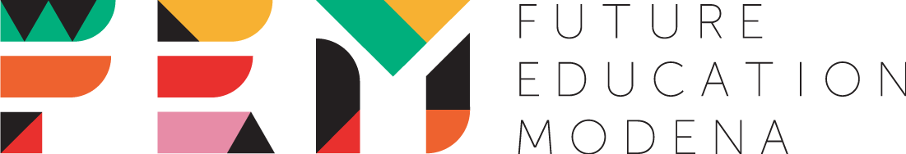

# GSuite e linguistica: spunti per migliorare le competenze di scrittura

## La nostra Classroom
Questo webinar fa parte di una programmazione più ampia, dedicata all’interazione tra linguistica e didattica in classe, e pensata per condividere e sviluppare attività, idee, suggerimenti, e per instaurare uno scambio di esperienze e necessità. Per questo abbiamo creato una piattaforma di discussione online: puoi accedere alla stanza dedicata di <a href="classroom.google.com/u/0/" target="_blank">Google Classroom</a>, utilizzando il codice **jdibcze**.
Speriamo che questa diventi un punto di incontro tra tutte le competenze fin qui coinvolte, per poterci scambiare opinioni sulle attività e proposte inedite per temi, metodi e strumenti di lavoro a scuola. 

## Le nostre proposte 
Vi abbiamo preparato una serie di attività di comprensione e scrittura a partire da diverse tipologie di testi letterari in uso a scuola, e in più una proposta per chi volesse cimentarsi con un testo argomentativo. Le attività sono pensate per le scuole secondarie di primo e di secondo grado, ed affrontano diverse caratteristiche linguistiche coinvolte nella comprensione e nella produzione di testi.

<i class="far fa-comment-dots" style="color:red"></i> ***Metafore concettuali***: le metafore influenzano/costruiscono il modo attraverso il quale concettualizziamo un argomento.  
<i class="far fa-comment-dots" style="color:blue"></i> ***Evidenzialità***: ciò che facciamo quando riportiamo delle informazioni acquisite da terze parti: citiamo le fonti? E se sì, in che modo ci rapportiamo ad esse? Ci fidiamo o facciamo capire che non siamo d’accordo?   
<i class="far fa-comment-dots" style="color:green"></i> ***Coesione e coerenza***: le regole *base* di un “buon testo”, così come sono state stilate dai linguisti Dressler e Beaugrande (*Introduzione alla linguistica testuale* 1984).   
<i class="far fa-comment-dots" style="color:purple"></i> ***Prosodia semantica***: l’uso delle giuste connotazioni e accezioni di significato a seconda del contesto, che una parola “si porta dietro” in base a come è stata utilizzata e percepita fino ad ora.   
<i class="far fa-comment-dots" style="color:DarkOrange"></i> ***Violenza verbale / hate-speech***

## Le schede attività | Template in GDoc
Di seguito i nostri **template** suddivisi per tipologia testuale, con le istruzioni e i testi già pronti per svolgere l’attività. Potete utilizzarli dopo averne fatto una copia nella vostra cartella di lavoro.

### Scuole secondarie - 1° grado
**Il romanzo horror**  
<a href="https://docs.google.com/document/d/1cFDdbOuxPv_eZe1a2Pn1M1slhVtwPbbpbIAAOKSvvf8/edit" target="_blank">Questo primo template</a> è calibrato sull’opera *Frankenstein* (Mary Shelley, 1818) e contiene spunti ed idee per attività di comprensione, scrittura, e valutazione di testi horror. Non ti piace **Frankenstein**? Perché non provare con **Dracula** o **Racconti fantastici e dell’orrore**?

**Il romanzo fantastico**  
<a href="https://drive.google.com/open?id=1IcSZDjVgdwnbtbTnNpjCZc08xdQ7gNWuuOBDpoz_shU" target="_blank">Questo template</a> è calibrato sull’opera *Dalla Terra alla Luna* (Jules Verne, 1865) e contiene spunti ed idee per attività di comprensione, scrittura, e valutazione di testi fantastici. Non ti piace **Dalla Terra alla Luna**? Perché non provare con **Alice nel paese delle meraviglie** o **I viaggi di Gulliver**?

### Scuole secondarie - 2° grado

**I Promessi Sposi**  
<a href="https://docs.google.com/document/d/1ogztNmFm9PdAAsvnND59dZ2EemqFLZ5cz6TWVGVPauw" target="_blank">Questo template</a> è calibrato sull’opera *I Promessi Sposi* (Alessandro Manzoni, 1842) e contiene spunti ed idee per attività di comprensione, scrittura, e valutazione di testi letterari. 

**Il testo argomentativo**  
<a href="https://docs.google.com/document/d/19tZeWgxqa9vMymbQZ8jc03qzw-rTYIHSj6QJuku8Shs" target="_blank">Questo template</a> è calibrato sull’analisi di testi argomentativi - in questo caso l’articolo *Strani giorni | Runner, untori e il bisogno di odiare chi esce da casa*, pubblicato sul sito linkiesta.it - e contiene spunti ed idee per attività di comprensione, scrittura, e valutazione di testi argomentativi. 

### Come sono strutturati i nostri **template**?
Ogni attività è pensata per essere disponibile in versione *avanzata* anche sulla piattaforma di annotazione **doccano**. Per ogni testo abbiamo preparato una tabella per annotare le caratteristiche testuali, con un focus particolare sulla <i class="far fa-comment-dots" style="color:purple"></i> *prosodia semantica*. Pensiamo infatti che identificare e annotare le caratteristiche salienti di una certa tipologia testuale sia il primo passo per imparare a scrivere un testo originale.
Nella sezione **Hai voglia di scrivere?** trovate alcuni spunti di scrittura che partono sempre da una *rielaborazione* delle caratteristiche annotate precedentemente. In **Valutiamoci!** vi proponiamo invece un’attività di *(auto)valutazione* da svolgere insieme ai vostri studenti utilizzando lo strumento **Voyant** per leggere i testi letterari. Perchè non provare a caricare i testi prodotti dagli studenti e lasciar loro la possibilità di *esplorarli*, magari concentrandosi sul lessico utilizzato o sull’uso delle connotazioni?

## Qualche attività **extra**: Esploriamo il testo?
Prima di far leggere i brani ai vostri studenti, vi proponiamo un’attività **esplorativa** utilizzando lo strumento <a href= "https://voyant-tools.org" target="_blank">Voyant</a> per la letteratura *a distanza* (dentro ad ogni template c’è un link per accedere ad una mini-guida all’uso di Voyant).    
Di seguito alcuni esperimenti linguistici sul testo di *Frankenstein*: abbiamo analizzato <a href= "https://voyant-tools.org/?corpus=c0ed31aa33706385f1d918bc3b09bc68&query=creatur*&panels=corpuscollocates,reader,trends,phrases,dreamscape&view=CorpusCollocates" target="_blank"> le collocazioni di "creatur\*" </a> e <a href= "https://voyant-tools.org/?corpus=c0ed31aa33706385f1d918bc3b09bc68&query=mostro*&panels=corpuscollocates,reader,trends,phrases,dreamscape&view=Contexts" target="_blank"> i contesti di "mostro" </a> perchè ci interessava capire quanto questi termini fossero caratterizzanti del linguaggio “dell’orrore” tipico del romanzo gotico. 

